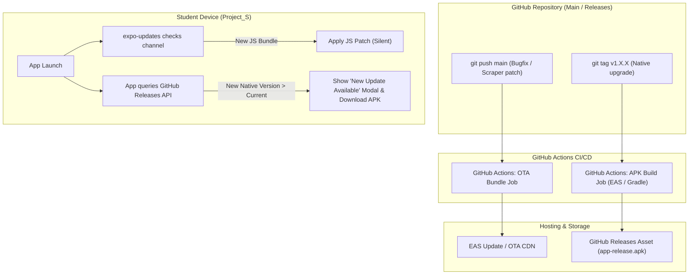

# Auto-Update Architecture & Strategy for Project_S

## 1. Executive Summary

As an open-source, community-driven student application for IISER Bhopal, **Project_S** requires an auto-update pipeline that meets the following criteria:
1. **Zero Cost & Free-Tier Sustainable**: No recurring server hosting or subscription fees for student maintainers.
2. **Instant Hotfixes**: Immediate distribution of scraper and UI patches when the underlying Shiksha ERP HTML changes, without forcing students to manually re-download APKs.
3. **Automated CI/CD**: Automatic builds and deployments triggered directly on `git push` to `main` or release tag creation in the GitHub repository.
4. **Resilient Dual-Tier Update Architecture**:
   - **Tier 1 (Over-The-Air / OTA)**: Silent, instant JavaScript bundle & asset updates for 90% of changes (UI bug fixes, Scraper parser tweaks, theme updates).
   - **Tier 2 (In-App Binary APK Updater)**: In-app prompt and automated APK downloader/installer for native binary upgrades (Expo SDK upgrades, new native modules, permission changes).

---

## 2. Technical Comparison of Update Mechanisms

| Mechanism | Update Scope | Cost | User Experience | Native Binary Changes? | Implementation Complexity |
| :--- | :--- | :--- | :--- | :--- | :--- |
| **EAS Update (`expo-updates`)** | JS Bundle & Assets (OTA) | Free Tier (1,000 MAU/month, unlimited builds locally) | Silent background download; applies seamlessly on next launch | ❌ No | Low (Official Expo library) |
| **Self-Hosted OTA (Hot-Updater / Custom Expo Server)** | JS Bundle & Assets (OTA) | 100% Free (GitHub Releases / Cloudflare R2 / Supabase) | Silent background download; bundle diffing | ❌ No | Medium |
| **In-App GitHub Releases APK Downloader** | Full Native Binary (APK) | 100% Free (GitHub REST API + Releases) | In-app modal with changelog, progress bar, & Android install prompt | ✅ Yes | Medium (Native Intent / FileSystem) |
| **Obtainium / F-Droid Distribution** | Full Native Binary (APK) | 100% Free | Fully automated background APK updates via third-party manager | ✅ Yes | Very Low for devs; requires student app |

---

## 3. Recommended Hybrid Architecture



---

## 4. Tier 1: Over-The-Air (OTA) Updates via `expo-updates`

### 4.1 How it Works
`expo-updates` downloads the compiled JavaScript bundle and static assets from an update server. When the app initializes, it checks if a newer bundle matching the app's `runtimeVersion` is available.

- **Primary Source Documentation**: [Expo Updates Documentation](https://docs.expo.dev/versions/latest/sdk/updates/) & [EAS Update GitHub Actions Guide](https://docs.expo.dev/eas-update/github-actions/).

### 4.2 Installation & Configuration
Install `expo-updates` in the `mobile/` directory:
```bash
npx expo install expo-updates
```

Configure `app.json`:
```json
{
  "expo": {
    "name": "Project_S",
    "slug": "project-s",
    "version": "1.0.0",
    "runtimeVersion": {
      "policy": "appVersion"
    },
    "updates": {
      "url": "https://u.expo.dev/YOUR-EXPO-PROJECT-ID",
      "enabled": true,
      "checkAutomatically": "ON_LOAD",
      "fallbackToCacheTimeout": 1000
    }
  }
}
```

### 4.3 GitHub Actions Workflow for Continuous OTA Deployment
Create `.github/workflows/deploy-ota.yml`:
```yaml
name: Deploy OTA Update

on:
  push:
    branches:
      - main
    paths:
      - 'mobile/src/**'
      - 'mobile/App.tsx'
      - 'mobile/package.json'

jobs:
  update:
    runs-on: ubuntu-latest
    steps:
      - name: 🏗 Checkout repo
        uses: actions/checkout@v4

      - name: 🏗 Setup Node.js
        uses: actions/setup-node@v4
        with:
          node-version: 20
          cache: 'npm'
          cache-dependency-path: 'mobile/package-lock.json'

      - name: 🏗 Setup EAS
        uses: expo/expo-github-action@v8
        with:
          eas-version: latest
          token: ${{ secrets.EXPO_TOKEN }}

      - name: 📦 Install dependencies
        working-directory: ./mobile
        run: npm ci

      - name: 🚀 Publish OTA Update
        working-directory: ./mobile
        run: eas update --branch production --message "Auto-deployed commit ${{ github.sha }} from GitHub Actions" --non-interactive
```

---

## 5. Tier 2: In-App GitHub Releases APK Updater (For Native Changes)

When upgrading native libraries (or for students without internet at the exact moment of an OTA check), an in-app binary update checker guarantees all students stay on the latest build.

### 5.1 Update Checker & Downloader Service
The app inspects GitHub's public Releases API (`https://api.github.com/repos/{owner}/{repo}/releases/latest`) on startup.

#### Architecture of In-App Updater:
1. **Version Comparison**: Compares `Application.nativeApplicationVersion` (e.g. `1.0.0`) with `release.tag_name` (e.g. `v1.1.0`).
2. **Release Notes Display**: Extracts the markdown release description from GitHub Release and presents it to the student.
3. **Background Download**: Uses `expo-file-system` to download `app-release.apk` with a download progress indicator.
4. **Android Package Installer Intent**: Triggers `expo-intent-launcher` to prompt Android's package installer:
   ```typescript
   import * as FileSystem from 'expo-file-system';
   import * as IntentLauncher from 'expo-intent-launcher';
   import * as Application from 'expo-application';

   export async function installDownloadedApk(apkUri: string) {
     const cUri = await FileSystem.getContentUriAsync(apkUri);
     await IntentLauncher.startActivityAsync('android.intent.action.VIEW', {
       data: cUri,
       flags: 1, // FLAG_GRANT_READ_URI_PERMISSION
       type: 'application/vnd.android.package-archive',
     });
   }
   ```

### 5.2 GitHub Actions Workflow for Building & Publishing APKs
Create `.github/workflows/build-apk.yml`:
```yaml
name: Build and Release APK

on:
  push:
    tags:
      - 'v*'

jobs:
  build:
    runs-on: ubuntu-latest
    steps:
      - name: 🏗 Checkout repository
        uses: actions/checkout@v4

      - name: 🏗 Setup Java 17
        uses: actions/setup-java@v4
        with:
          distribution: 'temurin'
          java-version: '17'

      - name: 🏗 Setup Node.js
        uses: actions/setup-node@v4
        with:
          node-version: 20
          cache: 'npm'
          cache-dependency-path: 'mobile/package-lock.json'

      - name: 📦 Install dependencies
        working-directory: ./mobile
        run: npm ci

      - name: ⚙️ Prebuild Android Project
        working-directory: ./mobile
        run: npx expo prebuild --platform android --clean

      - name: 🔨 Build Release APK
        working-directory: ./mobile/android
        run: ./gradlew assembleRelease --no-daemon

      - name: 🏷️ Publish GitHub Release with APK
        uses: softprops/action-gh-release@v2
        with:
          files: mobile/android/app/build/outputs/apk/release/app-release.apk
          generate_release_notes: true
        env:
          GITHUB_TOKEN: ${{ secrets.GITHUB_TOKEN }}
```

---

## 6. Sideload Ecosystem: Obtainium Integration

For advanced Android users in the campus community:
- **Obtainium** ([github.com/ImranR98/Obtainium](https://github.com/ImranR98/Obtainium)) is an open-source app manager that allows users to track GitHub repositories directly.
- **Student Setup**: Students paste `https://github.com/{owner}/Project_S` into Obtainium. Obtainium monitors releases in the background, downloads updates over Wi-Fi, and notifies or updates automatically.
- **Zero Configuration Required**: Works out of the box with standard GitHub Releases APK assets.

---

## 7. Security & Rollback Safeguards

1. **Code Signing**: Ensure release APKs are signed with a persistent release keystore stored as a secret in GitHub Secrets (`ANDROID_KEYSTORE_BASE64`, `ANDROID_KEYSTORE_PASSWORD`).
2. **Channel Isolation**: Use separate EAS channels:
   - `production`: For general student population.
   - `preview` / `staging`: For campus beta testers to verify scraper fixes against real portal responses before production rollout.
3. **Emergency Rollback**: If a bad JS update is published, rolling back on EAS takes seconds without building a new release:
   ```bash
   eas update:rollback --channel production
   ```

---

## 8. Implementation Roadmap

1. **Step 1**: Install `expo-updates` and configure `runtimeVersion` policy in `app.json`.
2. **Step 2**: Create Expo project on `expo.dev` (Free account) and generate an `EXPO_TOKEN` for GitHub Actions.
3. **Step 3**: Add `.github/workflows/deploy-ota.yml` to automatically push JS changes on merge to `main`.
4. **Step 4**: Add `.github/workflows/build-apk.yml` to automatically build signed APKs on GitHub release tags (`v1.0.1`, etc.).
5. **Step 5**: Build an in-app `UpdateBanner` or `UpdateModal` in `SettingsScreen` or `DashboardScreen` that surfaces release changelogs and download buttons.
