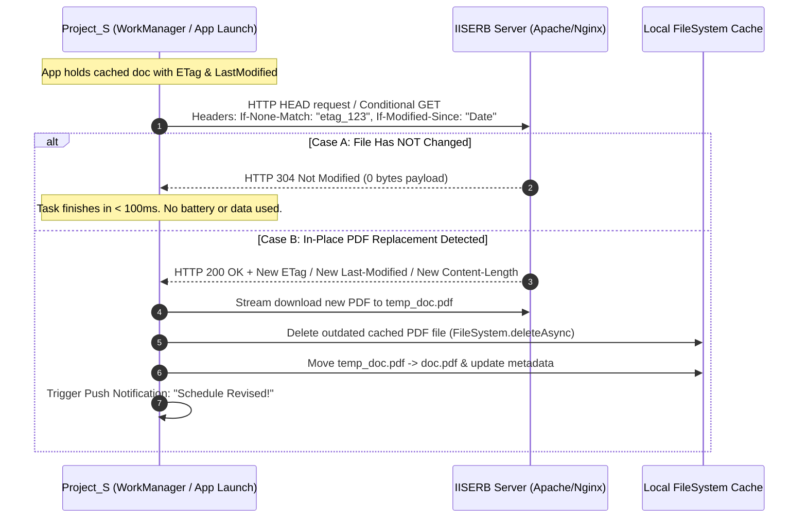
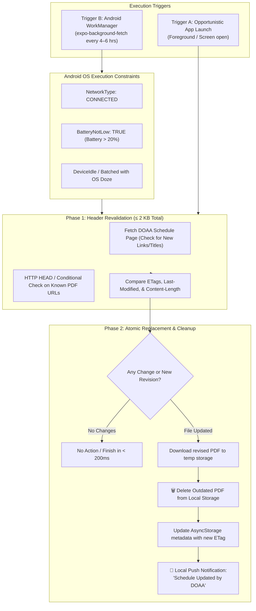

# DOAA Academic Schedules & Real-Time Sync Architecture

## 1. Executive Summary & Refined Scope

This document defines the architecture for real-time tracking, caching, and background synchronization of academic schedules for IISER Bhopal students in **Project_S**.

### 1.1 Scope Boundaries
- **IN SCOPE**: Core academic time-sensitive schedules from `https://www.iiserb.ac.in/doaa/schedule`:
  1. 📅 **Academic Calendars** (1st Year BS/BTech/BS-MS & Institute-wide Senior Batches)
  2. 🕒 **Class Timetables** (Semester-wise schedules from `acad.iiserb.ac.in`)
  3. 📝 **Exam Schedules** (Mid-Semester, End-Semester, Re-examination schedules)
  4. 🌴 **Institute Holidays** (Official annual holiday lists)
- **EXCLUDED**: General institutional forms, welfare proformas, and library forms (Section 2.2 excluded per design review).

---

## 2. Primary Source Endpoints

All live schedule assets originate from the DOAA schedule portal:

| Category | Schedule Document | Live Direct PDF URL | Change Frequency |
| :--- | :--- | :--- | :--- |
| **Calendar** | Academic Calendar - 2026 (1st Year) | `https://www.iiserb.ac.in/assets/off_academic_affairs/schedule/Academic_Calendar_Seme_1st.pdf` | Once per semester |
| **Calendar** | Academic Calendar - 2026 (General) | `https://www.iiserb.ac.in/assets/off_academic_affairs/schedule/Academic_Calendar_2026.pdf` | Once per academic year |
| **Timetable** | Class Time Table 2026-27 I Sem | `https://acad.iiserb.ac.in/pdf_docs/schedule/class_time_table.pdf` | 1–3 revisions at start of semester |
| **Holidays** | Holidays Calendar 2026 | `https://www.iiserb.ac.in/assets/all_upload/doaa/Holidays_Calendar_year_2026.pdf` | Annual |
| **Holidays** | Holidays Calendar 2027 | `https://www.iiserb.ac.in/assets/all_upload/doaa/Holidays_Calendar_year_2027.pdf` | Annual |
| **Mid-Sem** | Mid Semester Exam Schedule | `https://acad.iiserb.ac.in/pdf/Mid_Sem_Schedule.pdf` | 1–2 revisions prior to mid-sems |
| **End-Sem** | End Semester Exam Schedule | `https://acad.iiserb.ac.in/pdf/End_Semester_Examination_Schedule.pdf` | 1–2 revisions prior to end-sems |
| **Re-Exam** | Re-examination Schedule | `https://www.iiserb.ac.in/assets/all_upload/doaa/Re_examination_2026_Schedule.pdf` | Bi-annual |

---

## 3. Same-URL In-Place Update Detection (Zero-Payload Revalidation)

A frequent practice by the Academic Office (DOAA / Acad Portal) is **in-place file replacement**: uploading an updated PDF without changing the URL (e.g. `https://acad.iiserb.ac.in/pdf_docs/schedule/class_time_table.pdf` or `https://acad.iiserb.ac.in/pdf/Mid_Sem_Schedule.pdf`).

### 3.1 HTTP Header & Conditional Revalidation Mechanism

To detect file modifications under the **exact same URL** without downloading the heavy PDF binary every time:



### 3.2 Key Revalidation Headers Used

1. **`ETag` (Entity Tag)**:
   - Apache/Nginx web servers hosting `iiserb.ac.in` and `acad.iiserb.ac.in` generate a unique hash for static files based on filesystem inode, file size, and timestamp (e.g., `ETag: "3a8c1-610bc4b9e2880"`).
   - If DOAA overrides `class_time_table.pdf`, the `ETag` changes immediately.
2. **`Last-Modified` Timestamp**:
   - Contains the HTTP date of when the file was overwritten on the server (e.g., `Last-Modified: Fri, 15 Aug 2026 11:20:00 GMT`).
3. **`Content-Length` (Byte Count)**:
   - If the revision adds or alters timetable slots, the byte length changes.
4. **Conditional Request Protocol**:
   - The app sends:
     ```http
     HEAD /pdf_docs/schedule/class_time_table.pdf HTTP/1.1
     Host: acad.iiserb.ac.in
     If-None-Match: "cached-etag-value"
     If-Modified-Since: "cached-last-modified-date"
     ```
   - **Zero Bandwidth Overhead**: If unchanged, the server returns `304 Not Modified` with **0 bytes of body**. The total network payload for all 7 schedule documents is under **2 KB of headers**.

---

## 4. Background Sync & Zero-Battery-Drain Strategy

### 4.1 Dual-Trigger Architecture



### 4.2 Storage Garbage Collection Guarantee

To prevent storage accumulation on student devices:
1. Every document entry maintains a single persistent storage key (`${FileSystem.documentDirectory}academic_docs/${docId}.pdf`).
2. When a new revision is validated and downloaded to a staging file:
   ```typescript
   // Atomic cleanup and swap
   if (existingDoc.localUri && (await FileSystem.getInfoAsync(existingDoc.localUri)).exists) {
     await FileSystem.deleteAsync(existingDoc.localUri, { idempotent: true });
   }
   await FileSystem.moveAsync({
     from: tempDownloadUri,
     to: targetPermanentUri,
   });
   ```
3. Total storage used for all active academic schedules is strictly bounded to **< 20 MB**.

---

## 5. Push Notification Protocol

When a revised or new schedule is detected in the background:
- The app uses `expo-notifications` to emit an immediate high-priority local notification:
  - **Title**: `📅 Academic Schedule Updated`
  - **Body**: `Class Time Table (or Exam Schedule) has been updated on the DOAA portal.`
  - **Data Payload**: `{ docId: 'class_timetable', category: 'TIMETABLE', updated: true }`
- Tapping the notification deep-links directly into the In-App PDF Viewer to show the new document.

---

## 6. Implementation Architecture

1. **Service Layer (`AcademicDocsService.ts`)**:
   - Pre-seeded catalogue with fallback ETags and URLs.
   - `revalidateAllSchedules()`:
     - Discovers new URLs from `/doaa/schedule` HTML.
     - Runs concurrent `HEAD` requests for all active schedules.
     - Performs atomic download + old file purge for changed documents.
2. **Background Task (`BackgroundSyncTask.ts`)**:
   - `expo-task-manager` task definition integrated with `expo-background-fetch`.
3. **UI / Viewer (`AcademicDocsModal.tsx` & `AcademicDocViewerModal.tsx`)**:
   - Category filtering (`Calendars`, `Timetables`, `Exam Schedules`, `Holidays`).
   - In-app WebView PDF renderer + Native Android Intent launcher (`expo-intent-launcher`).
