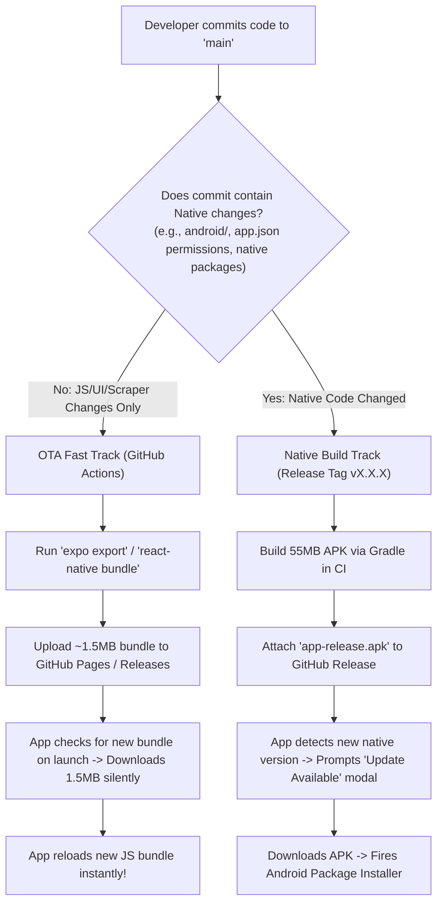

# Over-The-Air (OTA) & Differential Updates Research for Project_S

## 1. Executive Summary

When a bug fix or UI improvement is made in a React Native app (such as modifying `DashboardScreen.tsx` or updating a scraper regex in `ScraperService.ts`), users currently have to download and reinstall the entire **~45MB–65MB APK file**.

This research investigates **Over-The-Air (OTA) / Differential Updates** for **Project_S**:
- **Why Android OS requires full APKs**: Android's `PackageInstaller` operates strictly on signed, complete APK archives. It cannot patch individual files inside an existing installed APK at the OS level.
- **How React Native solves this**: React Native apps decouple the **Native Binary** (Android runtime, C++ libraries, Android permissions) from the **JavaScript Application Bundle** (`index.android.bundle` / Hermes Bytecode `.hbc`). The JS bundle can be dynamically replaced at runtime on the device without OS-level reinstallation.
- **Target Outcome**: Delivering **~1MB–2MB JS bundle hotfixes in 2–5 seconds** silently or seamlessly, reserving full APK downloads exclusively for major native SDK upgrades or Android permission changes.

---

## 2. Anatomy of an Update: Native Binary vs. JS Bundle

```
+-----------------------------------------------------------------------------------+
|                                  FULL APK (~55 MB)                                |
|                                                                                   |
|  [ NATIVE BINARY LAYER ] (Static, rarely changes)                                 |
|  - Android Manifest & Permissions (INTERNET, BIOMETRICS)                          |
|  - Compiled Java/Kotlin DEX bytecode                                              |
|  - C++ Native Libraries (libhermes.so, libreactnative.so, libfb.so) (~40 MB)      |
|  - Android Native Webview & Vector Icons bridges                                  |
|                                                                                   |
|  [ JAVASCRIPT & ASSET LAYER ] (Dynamic, changes on every code edit)               |
|  - index.android.bundle / Hermes Bytecode (All screens, services, scrapers) (~2MB)|
|  - App Assets (Icons, fonts, images) (~2-5 MB)                                    |
+-----------------------------------------------------------------------------------+
```

### What Can Be Updated via JS-Only (OTA) Updates?
| Update Type | Can use OTA JS-Only? (~1.5 MB) | Requires Full APK? (~55 MB) |
| :--- | :---: | :---: |
| UI/Screen Tweaks (`DashboardScreen.tsx`, `Theme.ts`) | **YES** | ❌ No |
| Portal Scraper logic (`ScraperService.ts`) | **YES** | ❌ No |
| Bug fixes in state, sync, or storage logic | **YES** | ❌ No |
| Course details / GPA calculation updates | **YES** | ❌ No |
| Adding new pure JS/TS dependencies (`date-fns`, `lodash`) | **YES** | ❌ No |
| Adding new Native Modules with Java/C++ (`react-native-nfc`) | ❌ No | **YES** |
| Changing `AndroidManifest.xml` permissions or intent filters | ❌ No | **YES** |
| Expo SDK major upgrades (e.g. SDK 52 -> SDK 53) | ❌ No | **YES** |

---

## 3. Comparison of OTA & Differential Update Architectures

### Option 1: EAS Update (Official Expo Service)
- **How it works**: Uses the official `expo-updates` library connected to Expo Application Services (EAS). Running `eas update --branch production` exports the JS bundle and changed assets, uploading them to Expo's global CDN.
- **Client Behavior**: `expo-updates` on the device checks for new update manifests on app startup. If a new manifest is found, it downloads **only the changed bundle and new assets** (using asset hash matching), caches them locally, and applies them on the next app restart (or immediately via `Updates.reloadAsync()`).
- **Cost**: **Free Tier** includes **1,000 Monthly Active Users (MAU)** and unlimited updates. (If IISERB user base exceeds 1,000 active students per month, bandwidth limits may apply).
- **Pros**: Zero backend infrastructure to manage; built natively into Expo; automatic asset deduplication.
- **Cons**: Tied to Expo cloud accounts and MAU quotas.

### Option 2: Self-Hosted Expo Updates (Custom Server / GitHub Pages / Cloudflare R2)
- **How it works**: `expo-updates` supports custom self-hosted endpoints compliant with the [Expo Updates Protocol](https://docs.expo.dev/technical-specs/expo-updates-server/).
  1. During CI (`npx expo export`), Expo generates an `export/` folder containing:
     - `metadata.json` (Manifest referencing the JS bundle hash and asset hashes).
     - `bundles/android-xxxx.hbc` (Compiled Hermes Bytecode bundle).
     - `assets/` (Hashed asset files).
  2. GitHub Actions publishes this `export/` directory to **GitHub Pages** (100% free, unlimited bandwidth) or Cloudflare R2 / AWS S3.
  3. The app's `app.json` configures:
     ```json
     "updates": {
       "url": "https://abhay-bhagat-319.github.io/Project_S/api/manifest",
       "enabled": true
     }
     ```
- **Cost**: **100% Free** with no user limits.
- **Pros**: Fully decentralized, open-source, uses existing GitHub infrastructure.
- **Cons**: Requires a minimal GitHub Pages static manifest structure or a Cloudflare Worker to serve HTTP headers (`expo-protocol-version: 1`).

### Option 3: Custom Lightweight Bundle Downloader (GitHub Releases Assets)
- **How it works**:
  1. GitHub Actions bundles the app via `npx react-native bundle --platform android --dev false --entry-file index.ts --bundle-output dist/index.android.bundle --assets-dest dist/`.
  2. The workflow zips `dist/` as `update-bundle-v1.0.X.zip` and attaches it to the GitHub Release.
  3. When `UpdateService.ts` queries the GitHub Releases API:
     - If the release only contains a JS bundle update (`isNative: false`), `UpdateService` downloads the **1.5MB `update-bundle.zip`** using `expo-file-system`.
     - It extracts the bundle into `FileSystem.documentDirectory + 'bundle/'`.
     - The app reloads using React Native's bundle loader without prompting Android Package Installer!
- **Cost**: **100% Free** (Unlimited through GitHub Releases).
- **Pros**: Direct control; no external services; perfectly unified with our current GitHub Releases workflow.

---

## 4. Size & Performance Comparison

| Metric | Full APK In-App Update (Current) | OTA JS Bundle Update (Proposed) |
| :--- | :--- | :--- |
| **Download Size** | **45 MB – 65 MB** | **1.2 MB – 2.0 MB** (~97% reduction) |
| **Download Time (4G/WiFi)** | 15 – 45 seconds | **0.5 – 2 seconds** |
| **Installation Friction** | Prompts Android system install screen | **Zero friction** (silent background apply or instant reload) |
| **User Permission** | Requires `REQUEST_INSTALL_PACKAGES` | **No permissions required** |
| **Data Usage Impact** | High data consumption | Negligible data consumption |

---

## 5. Recommended Dual-Track Implementation Strategy

To give Project_S both **instant low-bandwidth hotfixes** and **rock-solid native stability**, we recommend a **Dual-Tier Update Pipeline**:



---

## 6. Implementation Roadmap for Project_S

### Phase 1: Enable `expo-updates` with Self-Hosted GitHub Pages Manifest
1. Install `expo-updates` in `mobile/`:
   ```bash
   npx expo install expo-updates
   ```
2. Configure `app.json`:
   ```json
   {
     "expo": {
       "runtimeVersion": {
         "policy": "appVersion"
       },
       "updates": {
         "url": "https://abhay-bhagat-319.github.io/Project_S/manifest",
         "enabled": true,
         "checkAutomatically": "ON_LOAD",
         "fallbackToCacheTimeout": 0
       }
     }
   }
   ```
3. Set up a GitHub Actions workflow `.github/workflows/deploy-ota.yml` triggered on pushes to `main`:
   - Runs `npx expo export --platform android`.
   - Deploys the exported bundle & assets directly to the `gh-pages` branch.
4. Keep the existing **In-App APK Downloader** as the fallback tier for when `runtimeVersion` changes (native binary upgrades).

---

## 7. Primary Source References
- **Expo Updates Protocol Specification**: [https://docs.expo.dev/technical-specs/expo-updates-server/](https://docs.expo.dev/technical-specs/expo-updates-server/)
- **Expo Self-Hosting Guide**: [https://docs.expo.dev/distribution/runtime-versions/](https://docs.expo.dev/distribution/runtime-versions/)
- **React Native Bundle Architecture**: [https://reactnative.dev/docs/javascript-environment](https://reactnative.dev/docs/javascript-environment)
- **Android Package Manager & APK Signing**: [https://developer.android.com/about/versions/14/behavior-changes-all](https://developer.android.com/about/versions/14/behavior-changes-all)
