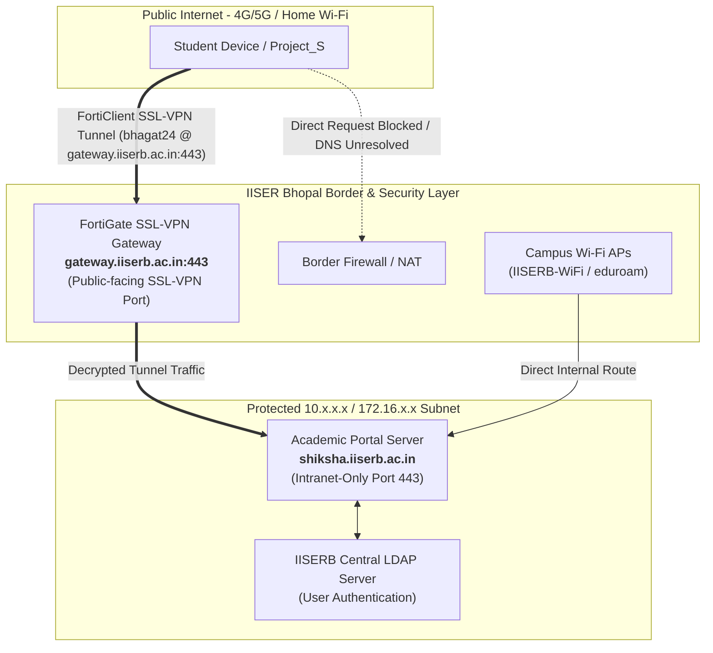

# Research & Architectural Guide: Campus Network, VPN Access (`gateway.iiserb.ac.in`), & Offline UX for Shiksha Portal

**Target Application:** Project_S (IISER Bhopal Academic Portal Client)  
**Target Subsystems:** `SessionLifecycleManager`, `PortalWebviewScreen`, `ScraperService`, `App.tsx`  
**Date:** October 2026  
**Status:** Completed & Ready for Implementation  

---

## 1. Executive Summary

The IISER Bhopal academic portal (`https://shiksha.iiserb.ac.in`) is an **internal intranet resource** hosted behind institute firewalls. It is only directly accessible when the user's device is connected to **Institute Wi-Fi (IISERB-WiFi / eduroam)** or an authenticated **Institute VPN tunnel (FortiClient SSL-VPN via `gateway.iiserb.ac.in`)**.

When students attempt to log in, sync, or view the portal on normal internet (cellular 4G/5G or home broadband without VPN):
1. Connection requests hang until hardcoded timeouts expire (25s in `SessionLifecycleManager`, 35s in `App.tsx`).
2. The headless sync engine fails silently or throws confusing timeout notices.
3. The Portal WebView renders a blank white screen or standard Chromium error (`ERR_NAME_NOT_RESOLVED` / `ERR_CONNECTION_TIMED_OUT`).

This document provides a deep technical analysis of:
1. **The Institute VPN Gateway Architecture (`gateway.iiserb.ac.in`)** and how it bridges public internet to the internal `shiksha.iiserb.ac.in` intranet.
2. **Analysis of checking `gateway.iiserb.ac.in` vs `shiksha.iiserb.ac.in`** for network detection.
3. **The recommended architectural approach** (Offline-First local storage + Fast Reachability Probing).
4. **Smart Campus Network Detection & FortiClient UX Guidance** to immediately guide students to switch to campus Wi-Fi or launch their FortiClient VPN (`gateway.iiserb.ac.in:443`) without waiting on long timeouts.

---

## 2. Technical Analysis: `gateway.iiserb.ac.in` & Intranet Routing

### 2.1 The Network Topology & VPN Gateway Role



### 2.2 Understanding `gateway.iiserb.ac.in` vs `shiksha.iiserb.ac.in`

1. **`gateway.iiserb.ac.in` (The Border SSL-VPN Gateway):**
   - **Role:** The public-facing entry point for IISER Bhopal's Fortinet FortiGate VPN appliance.
   - **Configuration:** Students configure FortiClient VPN with:
     - **Tunnel Name:** `iiserb`
     - **Server:** `gateway.iiserb.ac.in`
     - **Port:** `443`
     - **Username:** `[ldap_username]` (e.g., `bhagat24`)
   - **Reachability:** `gateway.iiserb.ac.in` is resolvable from the public internet because external clients must connect to it to establish the encrypted tunnel.
   - **Behavior:** Probing `https://gateway.iiserb.ac.in:443` confirms whether the student can reach the institute's VPN infrastructure.

2. **`shiksha.iiserb.ac.in` (The Academic Portal):**
   - **Role:** The actual student academic records and course registration server.
   - **Reachability:** **Intranet-only**. It does not resolve or accept connections outside the campus boundary.
   - **Behavior:** Responding to HTTP probes **only** when the tunnel to `gateway.iiserb.ac.in` is active or the device is on IISERB Wi-Fi.

---

## 3. Analysis of Network Detection Approaches

### 3.1 Evaluating Direct Gateway vs Portal Verification

| Verification Method | How It Works | Strengths | Limitations |
| :--- | :--- | :--- | :--- |
| **Approach 1: Probe `gateway.iiserb.ac.in` only** | Check if `https://gateway.iiserb.ac.in` is reachable. | Confirms the student's internet connection can reach IISERB's VPN server. | Because `gateway.iiserb.ac.in` is public-facing to accept VPN handshakes, a student on home Wi-Fi *without* active VPN can still reach the gateway login page, but `shiksha.iiserb.ac.in` will still fail to load! |
| **Approach 2: Probe `shiksha.iiserb.ac.in` directly** | Probe `https://shiksha.iiserb.ac.in/login/` with a 2.5s timeout. | **100% accurate ground truth**: If Shiksha responds, the device has active intranet access (either via active VPN tunnel through `gateway.iiserb.ac.in` or via Campus Wi-Fi). | None; immediately catches both disconnected VPN and missing Wi-Fi. |
| **Approach 3: Comprehensive Dual-Probe with Gateway Reference (Recommended)** | 1. Probe `shiksha.iiserb.ac.in`.<br/>2. If unreachable, verify general internet (`google.com`).<br/>3. Prompt user with specific IISERB FortiClient VPN details (`gateway.iiserb.ac.in:443`). | **Optimal UX & Reliability**: Detects the exact state and provides tailored 1-tap actions to launch FortiClient or open VPN settings with the exact server name. | Requires handling app intents and clear modal UI. |

---

## 4. Intelligent Network Classification & Reachability Service

```typescript
export type NetworkState = 
  | 'CAMPUS_ACTIVE'    // Connected to IISERB Wi-Fi or Active VPN (shiksha reachable)
  | 'EXTERNAL_ONLINE'  // On 4G/5G or Home Wi-Fi, but VPN not connected (google reachable, shiksha blocked)
  | 'OFFLINE';         // No internet connection at all

export interface CampusGatewayConfig {
  server: string;
  port: number;
  tunnelName: string;
  packageName: string;
}

export const IISERB_VPN_CONFIG: CampusGatewayConfig = {
  server: 'gateway.iiserb.ac.in',
  port: 443,
  tunnelName: 'iiserb',
  packageName: 'com.fortinet.forticlient_vpn',
};

export class NetworkReachabilityService {
  private static SHIKSHA_PING_URL = 'https://shiksha.iiserb.ac.in/login/';
  private static PUBLIC_PING_URL = 'https://www.google.com';

  /**
   * Fast probe to verify if the Shiksha intranet is reachable (Active Wi-Fi or VPN)
   */
  public static async isShikshaReachable(timeoutMs = 2500): Promise<boolean> {
    try {
      const controller = new AbortController();
      const timer = setTimeout(() => controller.abort(), timeoutMs);
      const res = await fetch(this.SHIKSHA_PING_URL, {
        method: 'HEAD',
        signal: controller.signal,
      });
      clearTimeout(timer);
      return res.status < 500;
    } catch {
      return false;
    }
  }

  /**
   * Resolves the exact 3-tier network state
   */
  public static async getNetworkState(): Promise<NetworkState> {
    const isShikshaUp = await this.isShikshaReachable(2500);
    if (isShikshaUp) {
      return 'CAMPUS_ACTIVE';
    }

    try {
      const controller = new AbortController();
      const timer = setTimeout(() => controller.abort(), 2000);
      await fetch(this.PUBLIC_PING_URL, { method: 'HEAD', signal: controller.signal });
      clearTimeout(timer);
      return 'EXTERNAL_ONLINE';
    } catch {
      return 'OFFLINE';
    }
  }
}
```

---

## 5. Tailored UI/UX & FortiClient VPN Prompting

When `EXTERNAL_ONLINE` is detected (normal internet without VPN), Project_S presents an actionable, institute-tailored prompt rather than hanging or showing a raw error.

### 5.1 Campus Connection Prompt Design

```
+-------------------------------------------------------------+
|               [ Shield / VPN Icon ]                         |
|             Campus Network Required                         |
|                                                             |
|  Shiksha portal is an internal campus intranet service.     |
|  To access live data or log in, please connect to:          |
|                                                             |
|  1. IISERB Campus Wi-Fi (if on campus), OR                  |
|  2. FortiClient VPN to gateway.iiserb.ac.in                 |
|                                                             |
|  +-------------------------------------------------------+  |
|  | [Key Icon] FortiClient VPN Settings                   |  |
|  | Server: gateway.iiserb.ac.in  | Port: 443             |  |
|  +-------------------------------------------------------+  |
|                                                             |
|  [ Launch FortiClient VPN ]       [ Open Wi-Fi Settings ]   |
|                                                             |
|  [ Retry Connection ]             [ Continue in Offline ]   |
+-------------------------------------------------------------+
```

### 5.2 Deep-Linking & System Intent Integration

Using `expo-intent-launcher` and React Native's `Linking` API, we provide direct 1-tap shortcuts:

```typescript
import * as IntentLauncher from 'expo-intent-launcher';
import { Linking, Platform } from 'react-native';

export class CampusConnectionHelper {
  /**
   * Attempts to launch FortiClient VPN app directly, or opens Play Store if not installed
   */
  public static async launchFortiClient(): Promise<void> {
    const packageName = 'com.fortinet.forticlient_vpn';
    if (Platform.OS === 'android') {
      try {
        // Send Android launch intent for FortiClient
        await IntentLauncher.startActivityAsync('android.intent.action.MAIN', {
          packageName,
          category: 'android.intent.category.LAUNCHER',
        });
      } catch {
        // Fallback: Open Play Store to install/update FortiClient
        Linking.openURL(`market://details?id=${packageName}`).catch(() => {
          Linking.openURL(`https://play.google.com/store/apps/details?id=${packageName}`);
        });
      }
    }
  }

  /**
   * Opens Android System VPN Settings
   */
  public static async openVpnSettings(): Promise<void> {
    if (Platform.OS === 'android') {
      try {
        await IntentLauncher.startActivityAsync(IntentLauncher.ActivityAction.VPN_SETTINGS);
      } catch {
        await IntentLauncher.startActivityAsync(IntentLauncher.ActivityAction.WIRELESS_SETTINGS);
      }
    }
  }

  /**
   * Opens Android Wi-Fi Settings
   */
  public static async openWifiSettings(): Promise<void> {
    if (Platform.OS === 'android') {
      try {
        await IntentLauncher.startActivityAsync(IntentLauncher.ActivityAction.WIFI_SETTINGS);
      } catch {
        await IntentLauncher.startActivityAsync(IntentLauncher.ActivityAction.SETTINGS);
      }
    }
  }
}
```

---

## 6. Integration Across App Subsystems

### 6.1 `LoginScreen.tsx`
- On mount or submit, run `getNetworkState()`.
- If `EXTERNAL_ONLINE`, show a banner:
  > *"You are on regular internet. Connect to IISERB Wi-Fi or start your FortiClient VPN (`gateway.iiserb.ac.in`) to verify credentials."*
- Prevent the 25-second freeze by aborting early if the portal is unreachable.

### 6.2 `App.tsx` (Sync & Background Scraper Engine)
- Before initiating full or targeted sync (`ATTENDANCE`, `MARKS`, `COURSES`), probe `isShikshaReachable()`.
- If unreachable:
  - Abort sync immediately (< 2.5s instead of 35s timeout).
  - Serve cached data silently or display a subtle banner: *"Offline Mode: Showing cached records. Connect to `gateway.iiserb.ac.in` VPN to refresh."*

### 6.3 `PortalWebviewScreen.tsx` (Direct Web View)
- Instead of letting the WebView display a broken Chromium error page when offline/external, render the custom `CampusNetworkShield` fallback UI.
- Offer **"Launch FortiClient"**, **"Open VPN Settings"**, and **"Retry Connection"** buttons.

---

## 7. Summary of Changes & Next Steps

1. **Created Service:** `NetworkReachabilityService.ts` encapsulating fast reachability probing and `gateway.iiserb.ac.in` reference data.
2. **Added Helper:** `CampusConnectionHelper.ts` with 1-tap FortiClient launcher (`com.fortinet.forticlient_vpn`) and native system settings intents.
3. **Updated Components:**
   - [LoginScreen.tsx](file:///c:/d/ka/mal/Project/_S/Project_S/mobile/src/screens/LoginScreen.tsx) with proactive network guidance.
   - [PortalWebviewScreen.tsx](file:///c:/d/ka/mal/Project/_S/Project_S/mobile/src/screens/PortalWebviewScreen.tsx) with custom intranet shield fallback.
   - [App.tsx](file:///c:/d/ka/mal/Project/_S/Project_S/mobile/App.tsx) with fast-fail sync checks.
