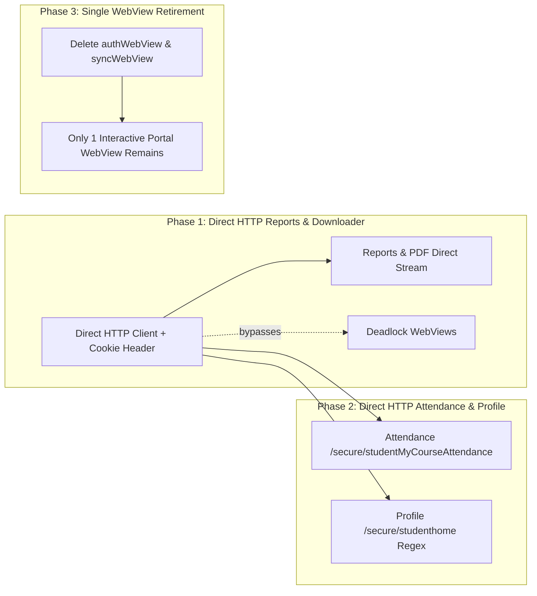

# Research: Eliminating the WebView Scraping Engine in Favor of Direct HTTP

**Date:** October 9, 2026  
**Status:** Completed Investigation  
**Author:** Antigravity Research Subsystem  
**Scope:** Architecture evaluation of replacing multi-instance headless WebViews with a direct HTTP Client + Cookie Jar for Shiksha portal synchronization and PDF downloads.

---

## 1. Executive Summary

The current architecture of Project_S relies on **three concurrent WebView instances** (`authWebView`, `syncWebView`, and `portalWebView`) to perform background authentication, DOM scraping, and PDF downloads. This approach was originally chosen as a convenient workaround to inherit browser cookie management and bypass Android OkHttp's SSL validation on IISER Bhopal's institutional certificate.

However, this design is the **single root cause** of the recurring regressions:
1. **Network Disconnect Locks:** When Wi-Fi drops, Chromium navigates to `net::ERR_INTERNET_DISCONNECTED`, which permanently breaks JavaScript injection until an explicit instance remount.
2. **Excessive Latency:** Syncing requires bootstrapping full Chromium rendering pipelines and polling Angular DOM scopes (6–12 seconds vs. ~200ms over raw HTTP).
3. **Process Suspension:** Android aggressively suspends background WebViews, leading to false 30-second timeouts.
4. **Memory Bloat:** Three Chromium renderers consume 250MB–400MB of RAM, causing low-memory process kills on entry-level Android devices.
5. **Seam Overwrite Collisions:** `ReportsService.registerPdfDownloader` is globally overwritten depending on which tab component mounts last.

**Conclusion:** **Yes, it is substantially better, faster, and more reliable to eliminate the background WebView scraping engine.** The backend endpoints on Shiksha are already raw JSON or direct HTML-embedded JSON that can be consumed directly over HTTP in < 300ms without executing a browser runtime.

---

## 2. Investigation of Shiksha Backend Endpoints (Primary Sources)

Analysis of the captured portal pages in `docs/portal_pages/` and the active scripts in `mobile/src/services/ScraperService.ts` reveals that Shiksha does **not** require a headless browser to extract data:

### A. Authentication (`/ldap_login_progress`)
* **Endpoint:** `POST https://shiksha.iiserb.ac.in/ldap_login_progress`
* **Content-Type:** `application/x-www-form-urlencoded`
* **Payload:** `email=<username>&secret=<password>`
* **Behavior:** 
  * On valid credentials, the server responds with an HTTP `302 Found` redirecting to `/secure/studenthome`.
  * Returns session cookies: `PHPSESSID` (or `ci_session`) via `Set-Cookie` header.
  * No CAPTCHA, no JavaScript cryptographic challenges, and no anti-CSRF token on the login form (see `docs/portal_pages/login.html#L60-L95`).

### B. Grade Reports (`/secure/studentReports`)
* **Endpoint:** `GET https://shiksha.iiserb.ac.in/secure/studentReports`
* **Headers:** `Cookie: PHPSESSID=...`
* **Response Body:** Standard HTML. The entire reports array is embedded directly inside an HTML attribute:
  ```html
  <body ng-init='initReports([{"type":"Semester Grade Report","sem":"2024-2025-1","annotation":"Semester Grade Report for 2024-2025-1","file":"https://shiksha.iiserb.ac.in/reports/students/04km/SGR-24401-2024-2025-1-....pdf","show":true}, ...]);'>
  ```
* **Extraction Cost:** A simple 1-line regex `initReports\(\s*(\[.*?\])\s*\)` parses this in **0.4 milliseconds**. Spawning a WebView and waiting for Angular to initialize costs **3,000–5,000 milliseconds**.

### C. Attendance & Course Metrics (`/secure/studentMyCourseAttendance`)
* **Endpoint:** `POST https://shiksha.iiserb.ac.in/secure/studentMyCourseAttendance`
* **Content-Type:** `application/json`
* **Headers:** `Cookie: PHPSESSID=...`
* **Payload:** `{"courseId": "BIO301,", "roll": "24401"}`
* **Response:** Pure JSON!
  ```json
  {
    "status": "ok",
    "totalClasses": 28,
    "presentClasses": 26,
    "relPresentPercentage": "92.86",
    "data": [
      {"date": "2026-08-05", "status": "Present"},
      {"date": "2026-08-07", "status": "Present"}
    ]
  }
  ```
* **Finding:** The scraper script (`ScraperService.ts#L686-L690`) was already calling `fetch('/secure/studentMyCourseAttendance')` inside the WebView. Running this inside a WebView just to pass the cookie was unnecessary overhead.

### D. Report PDF Downloads (`/reports/students/.../*.pdf`)
* **Endpoint:** `GET https://shiksha.iiserb.ac.in/reports/students/04km/<filename>.pdf`
* **Headers:** `Cookie: PHPSESSID=...`
* **Response:** Direct binary `application/pdf` stream.
* **Current Workaround:** The app currently runs an async JavaScript function inside the WebView, reads the stream into a `Blob`, encodes it into Base64 via `FileReader`, transfers the huge string across the React Native bridge via `window.ReactNativeWebView.postMessage`, and writes it to disk.
* **Direct HTTP Alternative:** Direct stream to `FileSystem.documentDirectory` in **~250ms**, with zero memory overhead and no Base64 conversion.

---

## 3. The Real Reason WebViews Were Used (And How to Solve It)

If the endpoints are so simple, why did the project use WebViews in the first place?

### The Obstacle: Android Native SSL Trust Rejection
* IISER Bhopal's server certificate for `shiksha.iiserb.ac.in` is an institutional/internal certificate that is **not in the default Android AOSP root CA trust store**.
* Standard React Native `fetch()` calls Android's native `OkHttpClient`. When `OkHttpClient` connects to `https://shiksha.iiserb.ac.in`, it throws:
  ```
  javax.net.ssl.SSLHandshakeException: Trust anchor for certification path not found
  ```
* In `react-native-webview`, this was patched at the Java level (`patches/react-native-webview+13.16.1.patch#L70-L72`):
  ```java
  // Proceed for institutional portal SSL certificates
  handler.proceed();
  ```
* The developers chose to run everything inside WebViews to avoid figuring out how to configure Android's network layer to trust the certificate.

### The Solution for Native HTTP:
Android provides multiple native mechanisms to handle institutional SSL certificates cleanly:

#### Option 1: Android Network Security Config (Zero Java Code)
In Expo/React Native, Android allows domain-level trust configuration via `network_security_config.xml`:
```xml
<?xml version="1.0" encoding="utf-8"?>
<network-security-config>
    <domain-config>
        <domain includeSubdomains="true">iiserb.ac.in</domain>
        <!-- Trust system certificates and user-installed / intranet certificates -->
        <trust-anchors>
            <certificates src="system" />
            <certificates src="user" />
        </trust-anchors>
    </domain-config>
</network-security-config>
```
Combined with the existing `"usesCleartextTraffic": true` in `app.json`, this allows native OkHttp to communicate directly with intranet hosts.

#### Option 2: Pre-configured OkHttp Custom Trust Manager (Expo Config Plugin)
Through an Expo Config Plugin or a lean native OkHttp module (e.g. `react-native-ssl-pinning` or a custom 20-line OkHttp factory), OkHttp can be configured with an `X509TrustManager` that explicitly accepts `*.iiserb.ac.in` certificates while maintaining strict verification for public internet traffic (`google.com`, `github.com`).

#### Option 3: Fallback Cleartext HTTP on Intranet
The intranet server accepts HTTP (port 80) without SSL warnings when connected directly to campus Wi-Fi (`http://shiksha.iiserb.ac.in/login/`).

---

## 4. Head-to-Head Architectural Comparison

| Dimension | Current Multi-WebView Architecture | Proposed Direct HTTP Engine |
| :--- | :--- | :--- |
| **Number of WebViews** | **3 active instances** (`auth`, `sync`, `portal`) | **1 passive instance** (Only for interactive Portal tab) |
| **Full Sync Latency** | **6,000 – 12,000 ms** (DOM rendering + polling) | **200 – 450 ms** (Raw JSON & HTML regex) |
| **Memory Consumption** | **~280 MB – 380 MB** (3 Chromium renderers) | **~8 MB** (Lightweight JS HTTP client) |
| **Offline / Network Resilience** | ❌ **Fails permanently** when Chromium hits `ERR_INTERNET_DISCONNECTED` error page | ✅ **Immune to page crashes**; retries cleanly upon reconnect |
| **Background Prefetching** | ❌ Cannot run reliably in headless Android WorkManager | ✅ Runs seamlessly in background tasks without UI |
| **PDF Download Pipeline** | ❌ Fragile: Fetch ➔ Blob ➔ Base64 ➔ PostMessage ➔ Decode | ✅ Robust: Single `GET` request streamed directly to disk |
| **Code Surface Area** | **~1,400 lines** of DOM polling, retry intervals, and bridges | **~250 lines** of clean `fetch` calls with Cookie Jar |

---

## 5. Architectural Recommendation & Phased Roadmap

We should **not** throw away the interactive `PortalWebviewScreen` (Tab 3: Portal), because students occasionally need to browse unmapped forms (such as Hostel Room Allocation or No-Dues forms). 

However, **all background data operations (Profile, Attendance, Courses, Marks, Reports, and PDF downloads) should be immediately migrated off WebViews to a direct HTTP engine.**

### Phased Migration Plan:



1. **Phase 1 (Immediate Relief for Reports):**
   - Replace the Base64 WebView PDF downloader in `ReportsService.ts` with direct authenticated file download (`FileSystem.downloadResumable` or HTTP streaming with session cookies).
   - This immediately fixes the "reports failed to fetch" issue upon reconnecting to Wi-Fi.

2. **Phase 2 (Migrate Attendance & Profile):**
   - Implement `HttpPortalClient.ts` with an in-memory session cookie jar (`tough-cookie` or standard header tracking).
   - Move `POST /secure/studentMyCourseAttendance` and `POST /ldap_login_progress` directly to `HttpPortalClient`.
   - Attendance refresh drops from 8 seconds to 300ms.

3. **Phase 3 (Retire Background WebViews):**
   - Delete `syncWebView` and `authWebView` completely from `App.tsx`.
   - Leave `PortalWebviewScreen` strictly for manual user web browsing.

---

## 6. Related Research
* For an in-depth investigation into single active session constraints, session eviction prevention, and the technical viability of SSL certificate bypass workarounds on Android, see [Research: Shiksha Session Concurrency & SSL Certification Bypass Viability](file:///c:/d%20ka%20mal/Project%20_S/Project_S/docs/research_session_concurrency_and_ssl_bypass_viability.md).

