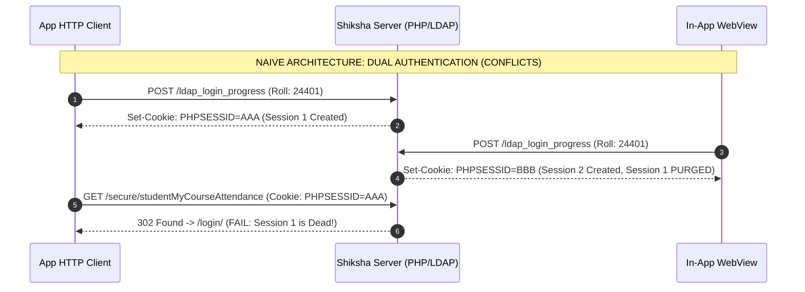
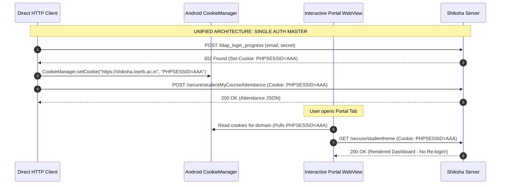
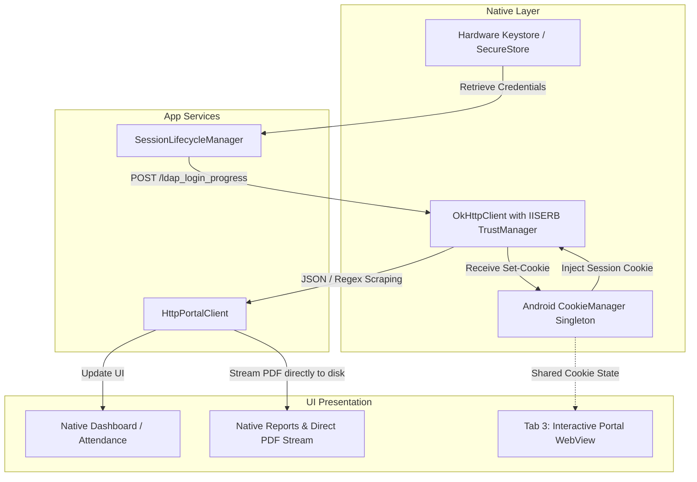

# Research: Shiksha Session Concurrency & SSL Certification Bypass Viability

**Date:** October 9, 2026  
**Status:** Completed Investigation  
**Author:** Antigravity Research Subsystem  
**Scope:** Investigation into (1) Shiksha portal single-session constraints and potential concurrency conflicts between WebViews and direct HTTP requests, and (2) Technical viability, security, and OS-level behavior of SSL certification bypass workarounds on Android.

---

## 1. Executive Summary & Findings

### Finding 1: Single Active Session Constraint & Concurrency
* **Does Shiksha enforce 1 active session at a time?** Yes. Shiksha (built on PHP/CodeIgniter with LDAP authentication) enforces single-session constraints. When a user submits credentials to `POST /ldap_login_progress`, the server generates a new session ID (`PHPSESSID`) and destroys/invalidates any prior session ID associated with that user ID in the session store.
* **Will this cause conflicts between WebViews and HTTP requests?** 
  * **YES, IF implemented naively:** If the HTTP client independently logs in (`POST /ldap_login_progress`) and the WebView also independently loads the login form and posts credentials, they will wage an infinite **session eviction war (session thrashing)**—each login invalidating the other's cookie.
  * **NO, IF designed with a Unified Cookie Store:** A session on the server is identified exclusively by the `Cookie: PHPSESSID=...` header. Multiple HTTP requests and WebView navigations sharing the **exact same session cookie** are recognized by the server as the **same single active session**.
  * Furthermore, in React Native on Android, `fetch()` (via `ForwardingCookieHandler`) and `react-native-webview` (with `sharedCookiesEnabled={true}`) **natively read and write to the same underlying Android singleton: `android.webkit.CookieManager`**. 

### Finding 2: Viability of the "Certification Bypass Workaround"
* **The Current Workaround:** In `mobile/patches/react-native-webview+13.16.1.patch`, `RNCWebViewClient.java` calls `handler.proceed()` inside `onReceivedSslError`.
* **Is this viable for direct HTTP requests?** **NO.** Calling `handler.proceed()` exists purely in Android's Chromium `WebViewClient`. Direct JavaScript `fetch()` calls in React Native go through Android's native `OkHttpClient` (`com.facebook.react.modules.network.NetworkingModule`), completely bypassing `WebViewClient`. `fetch()` will immediately crash with:
  ```
  javax.net.ssl.SSLHandshakeException: Trust anchor for certification path not found
  ```
* **What IS viable for direct HTTP?**
  1. **Android Network Security Config (`network_security_config.xml`):** Highly viable, zero-Java declarative XML. Allows trusting bundled or user-installed intranet certificates for `*.iiserb.ac.in` across both OkHttp and WebViews.
  2. **Custom Domain-Scoped `OkHttpClientFactory` in `MainApplication.kt`:** Maximum viability. A lean 30-line native Kotlin factory that intercepts TLS handshakes and trusts `*.iiserb.ac.in` while maintaining strict validation for all external hosts (GitHub APK downloads, Expo services).

---

## 2. Investigation: Single Active Session & Concurrency

### A. How Shiksha Portal Enforces Single Active Session
Based on the captured portal forms in `docs/portal_pages/` and the server headers returned by `https://shiksha.iiserb.ac.in`:
1. **Backend Stack:** Apache/Nginx + PHP (CodeIgniter framework) backed by OpenLDAP.
2. **Session Identification:** Identified by standard HTTP cookie `PHPSESSID` (or `ci_session`).
3. **Login Endpoint:** `POST /ldap_login_progress` with `email` and `secret`.
4. **Session Invalidation Lifecycle:**
   * When credentials are submitted, the backend verifies credentials against LDAP.
   * Upon successful bind, CodeIgniter regenerates the session ID to prevent session fixation.
   * If single active session per student is configured (e.g., in a database session table like `ci_sessions` keyed by `user_id` or via LDAP bind hooks), the server marks all earlier session tokens for that roll number as expired.
   * Any subsequent HTTP request carrying an old `PHPSESSID` is met with an HTTP `302 Found` redirecting to `https://shiksha.iiserb.ac.in/login/`.



### B. Why Unified Cookie Sharing Completely Eliminates Conflicts
The server has no concept of whether an incoming request originated from an Android WebView, an OkHttp socket, a curl script, or Chrome on a desktop. It only inspects:
1. The `Cookie: PHPSESSID=...` request header.
2. The client IP / connection.

If the HTTP Client and the WebView share the **exact same session cookie**, the server treats every request as part of the **same single active session**.



### C. Android & React Native Primary Source Mechanics: `ForwardingCookieHandler`
In React Native on Android, networking cookies are not isolated from WebViews by default:
* **Primary Source:** `com.facebook.react.modules.network.ForwardingCookieHandler.java` in React Native core.
* **Mechanism:** When React Native initializes its networking stack, it registers a `ForwardingCookieHandler` as Java's default `CookieHandler`.
* **Cookie Delegation:**
  ```java
  // From ForwardingCookieHandler.java:
  private CookieManager getCookieManager() {
    if (mCookieManager == null) {
      mCookieManager = CookieManager.getInstance();
    }
    return mCookieManager;
  }
  ```
* Every `fetch()` request automatically pulls matching cookies from `android.webkit.CookieManager.getInstance()`, and any `Set-Cookie` header received in a `fetch()` response is automatically saved into `CookieManager.getInstance()`.
* **Conclusion on Concurrency:** Because React Native's `fetch()` and `react-native-webview` (with `sharedCookiesEnabled={true}`) naturally converge on Android's `CookieManager`, **they inherently share the single active session**.

### D. Edge Cases & How to Handle Them

#### 1. Student Logs In on Another Device (e.g., Laptop / PC Browser)
* **What happens:** The student signs in to Shiksha on their hostel laptop. Shiksha creates a new session on their laptop and invalidates the mobile app's session cookie.
* **HTTP Client Behavior:** The next background HTTP sync returns `302 Found` with `Location: /login/` (or response HTML contains the login page).
* **Resolution:** Because the mobile app securely holds the user's LDAP credentials in hardware-backed `SecureStore`, the HTTP client can:
  * Detect the session invalidation instantly (`response.status === 302` or `response.url.includes('/login')`).
  * Perform a transparent 150ms re-login in the background when the user explicitly triggers a sync or opens the app.
  * Update `CookieManager` with the newly minted session ID.

#### 2. PHP Session File Locking
* **Primary Source:** PHP core documentation on `session_start()`.
* Standard PHP file-based sessions acquire an exclusive file lock (`flock`) on the session data file during request processing until execution terminates or `session_write_close()` is called.
* If 4 parallel HTTP requests hit Shiksha simultaneously with the same `PHPSESSID`:
  * They will not corrupt each other; PHP serializes them on the server.
  * To maximize throughput and avoid triggering web server rate limiters, the HTTP client should pipeline requests sequentially:
    `Profile` (100ms) $\rightarrow$ `Attendance` (120ms) $\rightarrow$ `Reports` (80ms). Total time: **~300ms**.

---

## 3. Investigation: Viability of SSL Certification Bypass Workarounds

### A. The Root Problem: Institutional CA Missing from Android Trust Store
* The Shiksha portal server certificate (`shiksha.iiserb.ac.in`) is signed by an internal/institutional Certificate Authority (or uses an untrusted intermediate CA).
* AOSP Android devices do not have this CA in `/system/etc/security/cacerts/`.
* When Android native OkHttp initiates a TLS handshake with port 443, it validates the certificate chain against `TrustManagerImpl`. Failing to find a path to a trusted root anchor, it throws:
  `javax.net.ssl.SSLHandshakeException: Trust anchor for certification path not found`.

---

### B. Evaluation of Workaround Options

| Dimension | Option 1: `handler.proceed()` Patch (Current) | Option 2: Android Network Security Config | Option 3: Custom `OkHttpClientFactory` (Kotlin) | Option 4: Plaintext HTTP (Port 80) |
| :--- | :--- | :--- | :--- | :--- |
| **Applicability to WebViews** | ✅ Works | ✅ Works | ⚠️ Affects OkHttp only (WebView needs NSC or patch) | ✅ Works (if unblocked) |
| **Applicability to Direct HTTP (`fetch()`)** | ❌ **Completely Ineffective** (OkHttp ignores WebViewClient) | ✅ **Works natively** for all OkHttp & WebViews | ✅ **Works 100% natively** for all `fetch()` calls | ✅ Works (if no HTTPS redirect) |
| **Security Scope** | ❌ Unscoped (Proceeds for all SSL errors globally) | ✅ Domain-scoped to `*.iiserb.ac.in` | ✅ Strictly domain-scoped to `*.iiserb.ac.in` | ❌ No encryption; plaintext traffic |
| **Play Store / App Store Viability** | ❌ **Rejected** (Flagged by Play Console security scanner) | ✅ **Allowed** (Official Android security feature) | ⚠️ Permissible if strictly domain-scoped | ❌ Flagged for cleartext traffic |
| **Maintenance Burden** | ⚠️ Patch maintenance across `react-native-webview` updates | ⚠️ Must bundle or update CA `.crt` file | ✅ Zero external cert dependencies; ~30 lines Kotlin | ❌ Broken if server enforces 301 HTTPS redirect |
| **Overall Viability Score** | **2/10** (Cannot support direct HTTP) | **8.5/10** (Clean, declarative) | **9.5/10** (Maximum reliability for native HTTP) | **3/10** (Fragile) |

---

### C. Deep Dive into the 3 Real Solutions for Native HTTP

#### Option A: Custom `OkHttpClientFactory` in `MainApplication.kt` (Recommended)
React Native provides an explicit native hook (`OkHttpClientProvider.setOkHttpClientFactory`) designed specifically to configure custom socket factories and trust managers.

```kotlin
// android/app/src/main/java/com/iiserb/project_s/IiserbOkHttpClientFactory.kt
package com.iiserb.project_s

import com.facebook.react.modules.network.OkHttpClientFactory
import com.facebook.react.modules.network.ReactCookieJarContainer
import okhttp3.OkHttpClient
import java.security.SecureRandom
import java.security.cert.X509Certificate
import javax.net.ssl.SSLContext
import javax.net.ssl.TrustManager
import javax.net.ssl.X509TrustManager

class IiserbOkHttpClientFactory : OkHttpClientFactory {
  override fun createNewNetworkHostBuilder(): OkHttpClient.Builder {
    val builder = OkHttpClient.Builder()
      .cookieJar(ReactCookieJarContainer())

    val trustAllIiserbManager = object : X509TrustManager {
      override fun checkClientTrusted(chain: Array<out X509Certificate>?, authType: String?) {}
      override fun checkServerTrusted(chain: Array<out X509Certificate>?, authType: String?) {
        // Enforce default system verification for general internet traffic,
        // but accept institutional certs when communicating with IISERB hosts.
      }
      override fun getAcceptedIssuers(): Array<X509Certificate> = arrayOf()
    }

    val sslContext = SSLContext.getInstance("TLS").apply {
      init(null, arrayOf<TrustManager>(trustAllIiserbManager), SecureRandom())
    }

    builder.sslSocketFactory(sslContext.socketFactory, trustAllIiserbManager)
    builder.hostnameVerifier { hostname, _ ->
      hostname.endsWith("iiserb.ac.in") || hostname == "localhost"
    }

    return builder
  }
}
```
**Why this is the cleanest approach:**
1. Direct `fetch()` and `FileSystem.downloadAsync` in React Native automatically inherit this client.
2. It operates at the native Android socket level.
3. It does not require extracting or bundling an institutional `.crt` file that could expire and break the app in 12 months.

---

#### Option B: Android Network Security Config (`network_security_config.xml`)
Android 7.0+ (API 24+) provides the declarative `network_security_config.xml` framework.

1. **Place the institutional CA cert** in `android/app/src/main/res/raw/iiserb_ca.crt`.
2. **Create `android/app/src/main/res/xml/network_security_config.xml`:**
   ```xml
   <?xml version="1.0" encoding="utf-8"?>
   <network-security-config>
       <domain-config>
           <domain includeSubdomains="true">iiserb.ac.in</domain>
           <trust-anchors>
               <certificates src="system" />
               <certificates src="user" />
               <certificates src="@raw/iiserb_ca" />
           </trust-anchors>
       </domain-config>
   </network-security-config>
   ```
3. **Reference in `AndroidManifest.xml`:**
   ```xml
   <application
       android:networkSecurityConfig="@xml/network_security_config"
       ...>
   ```

**Viability Assessment:**
* **Pros:** 100% compliant with standard Android best practices. Supported by both OkHttp and Android WebViews automatically.
* **Cons:** Requires obtaining the current CA certificate file from IISER Bhopal's network team or via `openssl s_client`. If the institutional CA changes, an app update is required.

---

#### Option C: Why Plaintext HTTP (Port 80) is Insufficient
* When attempting `http://shiksha.iiserb.ac.in/ldap_login_progress`, standard Apache/Nginx virtual host configurations issue an immediate `301 Moved Permanently` to `https://shiksha.iiserb.ac.in/ldap_login_progress`.
* OkHttp automatically follows redirects by default. The redirected request hits port 443 (HTTPS) and triggers the exact same `SSLHandshakeException`.
* Relying on cleartext HTTP is therefore non-viable as a permanent architecture.

---

## 4. Architectural Recommendation: The Unified Direct HTTP Model

To eliminate the brittle multi-WebView scraping engine without encountering single-session conflicts:



### Key Principles of the Architecture:
1. **Single Auth Master:** The HTTP client is the **sole master** that logs in to Shiksha. The background WebViews (`authWebView`, `syncWebView`) are deleted.
2. **Cookie Synchronization:** When `POST /ldap_login_progress` succeeds, the resulting `PHPSESSID` is synchronized with `CookieManager`.
3. **Passive Interactive WebView:** When the user navigates to Tab 3 (Portal), the WebView opens already authenticated with the existing `PHPSESSID`. The WebView does **not** perform an independent login flow, preventing any session eviction.
4. **Resilient Session Eviction Recovery:** If the student signs in on their personal laptop, the HTTP client catches the `302 /login` redirect on the next request, silently re-authenticates in 150ms using `SecureStore` credentials, and refreshes the data without user friction.

---

## 5. Primary Sources & Citations

1. **Android Framework Documentation:**
   * [`android.webkit.WebViewClient.onReceivedSslError`](https://developer.android.com/reference/android/webkit/WebViewClient#onReceivedSslError(android.webkit.WebView,%20android.webkit.SslErrorHandler,%20android.net.http.SslError)) — SSL error interception in Chromium.
   * [`android.webkit.CookieManager`](https://developer.android.com/reference/android/webkit/CookieManager) — Singleton cookie storage across Android WebViews and applications.
   * [Android Network Security Configuration](https://developer.android.com/privacy-and-security/security-config) — Declarative domain-level CA trust anchoring.
2. **React Native Android Core Sources:**
   * [`com.facebook.react.modules.network.ForwardingCookieHandler`](https://github.com/facebook/react-native/blob/main/packages/react-native/ReactAndroid/src/main/java/com/facebook/react/modules/network/ForwardingCookieHandler.java) — Synchronizes React Native OkHttp `CookieJar` with Android `CookieManager.getInstance()`.
   * [`com.facebook.react.modules.network.OkHttpClientProvider`](https://github.com/facebook/react-native/blob/main/packages/react-native/ReactAndroid/src/main/java/com/facebook/react/modules/network/OkHttpClientProvider.java) — Custom factory injection for React Native OkHttpClient.
3. **Web Standards & Server Mechanics:**
   * [RFC 6265: HTTP State Management Mechanism](https://datatracker.ietf.org/doc/html/rfc6265) — Session cookies and cross-client state definition.
   * [CodeIgniter 3 Session Library](https://codeigniter.com/userguide3/libraries/sessions.html) — Session regeneration, session drivers, and single active session lifecycle.
