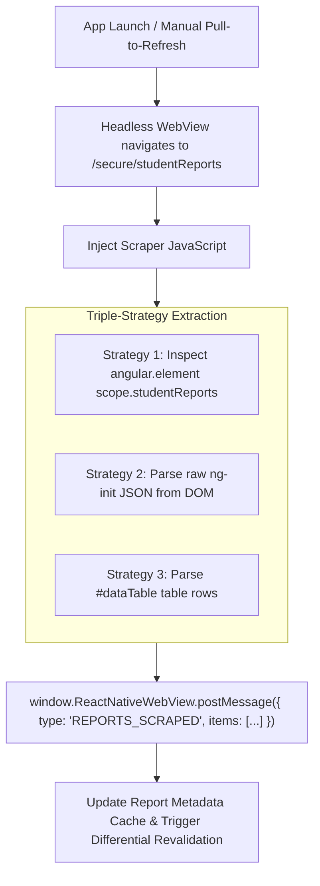
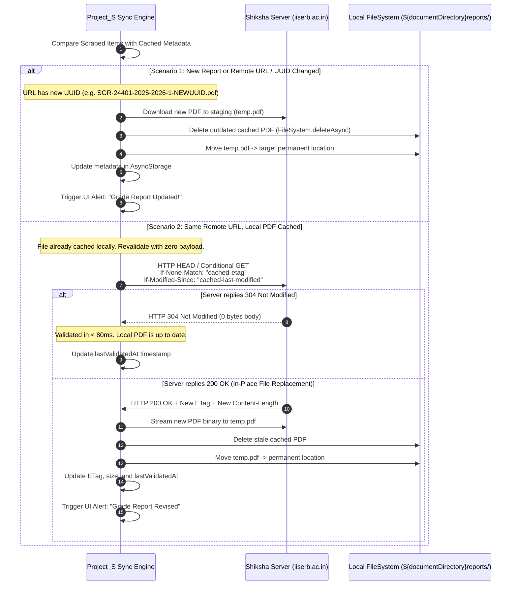

# Student Report Cards & Offline PDF Caching Architecture

## 1. Executive Summary & Problem Formulation

In IISER Bhopal's academic workflow, student grade reports (Semester Grade Reports - **SGR**, Cumulative Grade Reports - **CGR**, and Transcripts) represent vital, high-frequency reference documents. While the web portal (`https://shiksha.iiserb.ac.in/secure/studentReports`) requires active internet, session authentication, and manual downloads, **Project_S** requires a first-class, dedicated **Report Cards** module with:

1. **Instant Offline Availability**: Once downloaded, grade reports are cached locally on disk and accessible instantly without network connectivity or portal re-login.
2. **Dedicated Cache Isolation**: An independent storage partition and metadata index (`reports/` directory + `AsyncStorage` registry) separate from volatile API cache.
3. **Differential In-Place Revision Detection**: While finalized grade reports are static by default, grade alterations (e.g. re-evaluations, instructor grade revisions, DUGC corrections, or backlog clearances) occur. The app must periodically revalidate cached report cards and atomically replace outdated PDFs without user intervention or unnecessary bandwidth drain.
4. **Native In-App Viewing & Export**: Direct in-app PDF rendering with zoom controls, export to Android file storage, and OS share sheet integration.

---

## 2. Primary Source DOM & Portal Data Analysis

Analysis of the live source DOM at [docs/portal_pages/reports.html](file:///c:/d%20ka%20mal/Project%20_S/Project_S/docs/portal_pages/reports.html) reveals how Shiksha structures and generates student report cards.

### 2.1 Angular Controller & Initialization State

The page runs on AngularJS 1.x with `ng-app="studentReport"` and `ng-controller="studentReportController"`. On page load, the server injects student report metadata directly into `ng-init` on the `<body>` element:

```html
<body id="layouts-horizontal" 
      ng-app="studentReport" 
      ng-init="initReports([
        {
          "type": "Semester Grade Report",
          "sem": "2024-2025-1",
          "annotation": "Semester Grade Report for 2024-2025-1",
          "file": "https://shiksha.iiserb.ac.in/reports/students/04km/SGR-24401-2024-2025-1-e9ef0c34-8fb9-4a7a-9915-40608b5c24d8.pdf",
          "show": true
        },
        {
          "type": "Semester Grade Report",
          "sem": "2024-2025-2",
          "annotation": "Semester Grade Report for 2024-2025-2",
          "file": "https://shiksha.iiserb.ac.in/reports/students/04km/SGR-24401-2024-2025-2-bdaa482a-68ac-4cbe-bc84-bc9a070e3319.pdf",
          "show": true
        },
        {
          "type": "Semester Grade Report",
          "sem": "2025-2026-1",
          "annotation": "Semester Grade Report for 2025-2026-1",
          "file": "https://shiksha.iiserb.ac.in/reports/students/04km/SGR-24401-2025-2026-1-0b512d41-288c-4e93-9b37-b8210f6918c1.pdf",
          "show": true
        },
        {
          "type": "Semester Grade Report",
          "sem": "2025-2026-2",
          "annotation": "Semester Grade Report for 2025-2026-2",
          "file": "https://shiksha.iiserb.ac.in/reports/students/04km/SGR-24401-2025-2026-2-ad21398b-fd27-479c-9a0c-c72f7fc6dc00.pdf",
          "show": true
        },
        {
          "type": "Cumulative Grade Report",
          "sem": "2025-2026-3",
          "annotation": "Cumulative Grade Report upto 2025-2026-3",
          "file": "https://shiksha.iiserb.ac.in/reports/students/04km/CGR-24401-2025-2026-3-95050231-10a8-4f6b-99f2-cf1041638f54.pdf",
          "show": true
        },
        {
          "type": "Semester Grade Report",
          "sem": "2025-2026-3",
          "annotation": "Semester Grade Report for 2025-2026-3",
          "file": "https://shiksha.iiserb.ac.in/reports/students/04km/SGR-24401-2025-2026-3-f05adb61-3bd1-4e63-ba27-b844e7ac76a8.pdf",
          "show": true
        }
      ]); initStudentRoll(24401);" 
      ng-controller="studentReportController">
```

### 2.2 Schema & Key Fields

| Field | Type | Description & Example |
| :--- | :--- | :--- |
| `type` | `string` | Report classification (`Semester Grade Report`, `Cumulative Grade Report`, `Transcript`). |
| `sem` | `string` | Academic session identifier (`YYYY-YYYY-N`, e.g., `2024-2025-1`, `2025-2026-3`). |
| `annotation` | `string` | Descriptive title (`Semester Grade Report for 2024-2025-1`, `Cumulative Grade Report upto 2025-2026-3`). |
| `file` | `string` | Direct authenticated/static CDN URL on Shiksha (`https://shiksha.iiserb.ac.in/reports/students/{folder}/{prefix}-{roll}-{sem}-{uuid}.pdf`). |
| `show` | `boolean` | Portal visibility toggle. |

### 2.3 URL Hash Pattern & Regeneration Dynamics

The file URL follows a deterministic server-generated scheme:
```
https://shiksha.iiserb.ac.in/reports/students/{hash_folder}/{DOC_TYPE}-{ROLL}-{SEM}-{UUID}.pdf
```
- **DOC_TYPE**: `SGR` (Semester Grade Report) or `CGR` (Cumulative Grade Report).
- **UUID**: Unique generation token (e.g. `e9ef0c34-8fb9-4a7a-9915-40608b5c24d8`).
- **Revision Behaviour**:
  - **Case 1 (New Generation)**: If the Shiksha backend regenerates a grade report, the UUID in the URL changes, updating the `file` field in `initReports`.
  - **Case 2 (In-Place Rewrite)**: If the backend overwrites the existing file path, the URL stays identical while the server `Last-Modified` timestamp and `ETag` update.

---

## 3. Scraping & Data Ingestion Strategy

### 3.1 Scraping Execution Hook

Scraping `/secure/studentReports` integrates into the headless sync flow alongside profile and attendance retrieval:



### 3.2 Injected Extraction Script

```javascript
(function() {
  try {
    var items = [];
    var roll = '';

    // Strategy 1: Angular Controller Scope
    var el = document.querySelector('[ng-controller="studentReportController"]') || document.body;
    var scope = (typeof angular !== 'undefined' && angular.element) ? angular.element(el).scope() : null;
    
    if (scope && Array.isArray(scope.studentReports) && scope.studentReports.length > 0) {
      items = scope.studentReports;
      roll = scope.studentRoll || '';
    }

    // Strategy 2: Fallback Regex from DOM ng-init
    if (items.length === 0) {
      var bodyHtml = document.body ? document.body.outerHTML : '';
      var match = bodyHtml.match(/initReports\s*\(\s*(\[\s*\{.*?\}\s*\])\s*\)/s);
      if (match && match[1]) {
        try {
          items = JSON.parse(match[1]);
        } catch (e) {}
      }
      var rollMatch = bodyHtml.match(/initStudentRoll\s*\(\s*['"]?(\d+)['"]?\s*\)/);
      if (rollMatch) roll = rollMatch[1];
    }

    // Strategy 3: DOM Table Parsing
    if (items.length === 0) {
      var rows = Array.from(document.querySelectorAll('#dataTable tbody tr'));
      items = rows.map(function(row) {
        var cells = row.querySelectorAll('td');
        if (cells.length >= 4) {
          return {
            sem: cells[1].innerText.trim(),
            type: cells[2].innerText.trim(),
            annotation: cells[3].innerText.trim(),
            file: '',
            show: true
          };
        }
        return null;
      }).filter(Boolean);
    }

    window.ReactNativeWebView.postMessage(JSON.stringify({
      type: 'REPORTS_SCRAPED',
      status: 'success',
      roll: roll ? roll.toString() : '',
      items: items
    }));
  } catch (err) {
    window.ReactNativeWebView.postMessage(JSON.stringify({
      type: 'ERROR',
      message: 'Failed to scrape student reports: ' + err.message
    }));
  }
})();
true;
```

---

## 4. Multi-Tier Caching & In-Place Revalidation Protocol

Because academic grade reports are required for internships, registrations, and official verifications, the caching architecture guarantees zero network dependence once downloaded while ensuring data consistency.

### 4.1 Storage Architecture & Isolation

```
DocumentDirectory/
├── reports/                          <-- Dedicated Reports Storage Subdirectory
│   ├── SGR_24401_2024-2025-1_e9ef0c.pdf
│   ├── SGR_24401_2024-2025-2_bdaa48.pdf
│   ├── SGR_24401_2025-2026-1_0b512d.pdf
│   ├── CGR_24401_2025-2026-3_950502.pdf
│   └── temp_staging_download.pdf
└── ...
```

#### TypeScript Data Contract

```typescript
export interface StudentReportItem {
  id: string;                    // Deterministic key: `${typeSlug}_${sem}`
  sem: string;                   // "2024-2025-1"
  type: 'Semester Grade Report' | 'Cumulative Grade Report' | string;
  annotation: string;            // "Semester Grade Report for 2024-2025-1"
  remoteUrl: string;             // Remote Shiksha PDF URL
  localPdfUri: string | null;    // Permanent local FileSystem path
  fileSizeBytes: number;         // File size on disk
  isDownloaded: boolean;         // True if verified existing on disk
  etag: string | null;           // HTTP ETag from server for zero-byte revalidation
  lastModified: string | null;   // HTTP Last-Modified header
  downloadedAt: number | null;   // Epoch timestamp of download
  lastValidatedAt: number;       // Epoch timestamp of last differential check
  spi?: number;                  // Extracted SPI if present in metadata
  cpi?: number;                  // Extracted CPI if present in metadata
}

export interface StudentReportsCache {
  roll: string;
  items: StudentReportItem[];
  lastSyncTime: number;
}
```

### 4.2 Differential Revalidation (Change-Detection Protocol)

To detect if a grade report has been modified on the portal without re-downloading unchanged 500KB–2MB PDFs on every sync:



### 4.3 Atomic File Replacement & Storage Safety

To prevent corrupt or partial downloads from overwriting working cached report cards:

1. **Staging Download**: Downloads target a temporary file (`${FileSystem.cacheDirectory}staging_report_${Date.now()}.pdf`).
2. **Integrity Validation**: Validate that file size is $> 1024$ bytes and starts with the `%PDF-` magic header.
3. **Atomic Move**: Safely delete any existing file at the target URI and move the staged file into `${FileSystem.documentDirectory}reports/`.

```typescript
const tempUri = `${FileSystem.cacheDirectory}staging_${Date.now()}.pdf`;
const targetUri = `${FileSystem.documentDirectory}reports/${reportId}.pdf`;

const downloadResult = await FileSystem.downloadAsync(report.remoteUrl, tempUri);
if (downloadResult.status === 200) {
  const fileInfo = await FileSystem.getInfoAsync(tempUri);
  if (fileInfo.exists && fileInfo.size > 1024) {
    const existing = await FileSystem.getInfoAsync(targetUri);
    if (existing.exists) {
      await FileSystem.deleteAsync(targetUri, { idempotent: true });
    }
    await FileSystem.moveAsync({ from: tempUri, to: targetUri });
  }
}
```

---

## 5. Dedicated Report Cards Section UI/UX Design

### 5.1 Visual Hierarchy & Component Architecture

The Report Cards interface lives in a dedicated, high-agency view (accessible via the **Dashboard** academic section or a **Reports** tab/modal):

```
+-------------------------------------------------------------+
|  <- Grade & Report Cards                      [Sync All]    |
+-------------------------------------------------------------+
|  [All (6)]   [Semester Reports (5)]   [Cumulative (1)]      |
+-------------------------------------------------------------+
|                                                             |
|  +-------------------------------------------------------+  |
|  | [SGR Icon]  Semester Grade Report       [Offline Ready] |  |
|  | 2025-2026-3 • Spring Semester                         |  |
|  | SPI: 8.50  •  CPI: 8.24                               |  |
|  | [ View PDF ]               [ Share ]    [ Re-download ]|  |
|  +-------------------------------------------------------+  |
|                                                             |
|  +-------------------------------------------------------+  |
|  | [CGR Icon]  Cumulative Grade Report     [Offline Ready] |  |
|  | Upto 2025-2026-3                                      |  |
|  | Cumulative Performance Transcript                     |  |
|  | [ View PDF ]               [ Share ]    [ Re-download ]|  |
|  +-------------------------------------------------------+  |
|                                                             |
|  +-------------------------------------------------------+  |
|  | [SGR Icon]  Semester Grade Report           [Download]  |  |
|  | 2024-2025-1 • Monsoon Semester                        |  |
|  | SPI: 8.00  •  CPI: 8.00                               |  |
|  | [ Download & View ]                    [ Cloud Only ] |  |
|  +-------------------------------------------------------+  |
+-------------------------------------------------------------+
```

### 5.2 Card Elements & Interactions

1. **Category Filter Chips**:
   - `All Reports`, `Semester Grade Reports (SGR)`, `Cumulative (CGR)`.
2. **Status Badges**:
   - 🟢 `Offline Ready`: Stored locally; opens instantly in 0ms without internet.
   - 🔵 `Online / On-Demand`: Available on portal; tap downloads and caches locally.
   - 🟡 `Updated Revision`: Displayed when a newer revision has been downloaded.
3. **Primary Actions**:
   - **View PDF**: Opens the built-in native PDF viewer modal with pinch-to-zoom and page scrubber.
   - **Share / Export**: Triggers `expo-sharing` (`Sharing.shareAsync`) allowing students to email or save the PDF directly to Google Drive, WhatsApp, or local device storage.
   - **Force Re-validate**: On-demand HEAD check and re-download.

---

## 6. Implementation Plan & File Additions

| Step | Component / File | Purpose |
| :--- | :--- | :--- |
| **1. Scraping** | [mobile/src/services/ScraperService.ts](file:///c:/d%20ka%20mal/Project%20_S/Project_S/mobile/src/services/ScraperService.ts) | Add `getReportsScraperScript()` to extract `studentReports` and `studentRoll` from `/secure/studentReports`. |
| **2. Storage & Cache** | [mobile/src/services/ReportCacheService.ts](file:///c:/d%20ka%20mal/Project%20_S/Project_S/mobile/src/services/ReportCacheService.ts) *(New)* | Dedicated service for report cards: metadata persistence, directory setup (`reports/`), atomic download, differential HEAD revalidation, and disk space calculation. |
| **3. Cache Service Hook** | [mobile/src/services/CacheService.ts](file:///c:/d%20ka%20mal/Project%20_S/Project_S/mobile/src/services/CacheService.ts) | Integrate report cache size into `getCacheStats()` and include reports cleanup in `clearCache()`. |
| **4. UI Screen** | [mobile/src/screens/ReportCardsScreen.tsx](file:///c:/d%20ka%20mal/Project%20_S/Project_S/mobile/src/screens/ReportCardsScreen.tsx) *(New)* | Native Dark Mode screen displaying categorized grade cards, download progress indicators, offline status chips, and action handlers. |
| **5. PDF Viewer** | [mobile/src/screens/PdfViewerModal.tsx](file:///c:/d%20ka%20mal/Project%20_S/Project_S/mobile/src/screens/PdfViewerModal.tsx) *(New)* | In-app full-screen PDF renderer utilizing `react-native-webview` / `expo-sharing`. |
| **6. App Navigation** | [mobile/App.tsx](file:///c:/d%20ka%20mal/Project%20_S/Project_S/mobile/App.tsx) & [mobile/src/screens/DashboardScreen.tsx](file:///c:/d%20ka%20mal/Project%20_S/Project_S/mobile/src/screens/DashboardScreen.tsx) | Add a quick-access "Report Cards" card/button on the dashboard and handle `REPORTS_SCRAPED` events in the sync WebView. |

---

## 7. Security & Session Handling

- **Authenticated vs Public Static Assets**: Shiksha generates report PDFs under paths like `https://shiksha.iiserb.ac.in/reports/students/04km/SGR-...`. The downloading service ensures that session cookies (`connect.sid` / bearer headers) from the authenticated WebView are forwarded when issuing download/HEAD requests.
- **Data Privacy**: PDFs are stored inside `${FileSystem.documentDirectory}reports/`, which is sandboxed per-application on Android and iOS and not accessible to other third-party apps unless explicitly shared via the OS share sheet.
