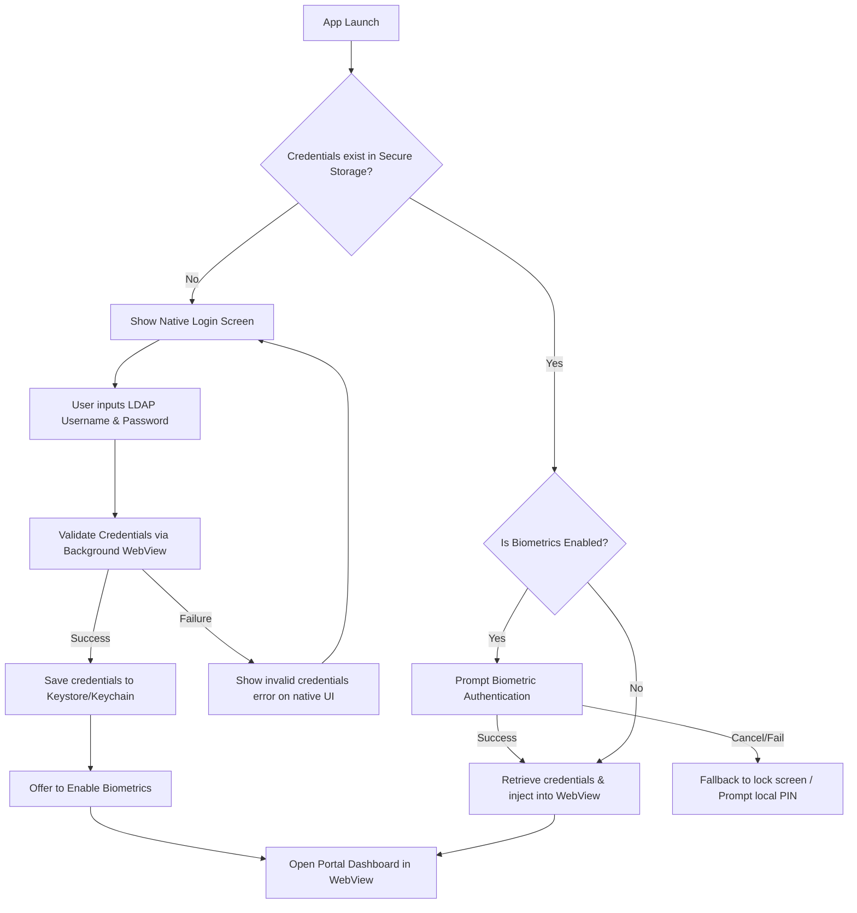

# Research Report: WebView-based App for University Student Portal

This report investigates the feasibility, architectural options, implementation techniques, and critical security implications of building a WebView-based mobile application for a university student portal, focusing on UI customization via CSS/JS injection and automated login session persistence.

---

## 1. Architectural Options (Frameworks)

A WebView app wraps an existing website in a native mobile container. The main options for implementation are:

### A. Hybrid Frameworks (Recommended for speed & cross-platform)
*   **React Native (`react-native-webview`)**: Good if you want to write cross-platform JavaScript/TypeScript. Excellent library support for secure storage (`react-native-keychain`) and biometric authentication.
*   **Flutter (`webview_flutter` or `flutter_inappwebview`)**: Excellent performance and highly customizable. `flutter_inappwebview` is particularly powerful because it allows script injection before the page load begins (`AT_DOCUMENT_START`).
*   **Capacitor (Ionic)**: Designed specifically for packaging web apps. It provides native plugins out-of-the-box, but is less flexible if the target website is hosted externally and not bundled locally.

### B. Pure Native (Android Kotlin / iOS Swift)
*   Provides the lowest overhead and maximum control over the native components (`WebView` / `WKWebView`), but requires writing and maintaining two separate codebases.

---

## 2. CSS & JavaScript Injection

To transform a desktop-centric website into a mobile-first application, custom CSS must be injected to hide headers/footers, adjust layout widths, and style buttons for touch targets.

### Implementation Patterns

#### React Native Example
Since WebView components do not support direct CSS stylesheet injection, you must inject JavaScript that programmatically inserts a `<style>` tag into the document's `<head>`.

```javascript
// CSS payload to inject
const customCSS = `
  /* Hide desktop header and footer */
  header, footer, .desktop-only-sidebar {
    display: none !important;
  }
  /* Optimize container for mobile viewports */
  .main-content-container {
    width: 100% !important;
    margin: 0 !important;
    padding: 16px !important;
  }
`;

// Script wrapper to inject
const injectStyleScript = `
  (function() {
    var style = document.createElement('style');
    style.type = 'text/css';
    style.innerHTML = \`${customCSS}\`;
    document.head.appendChild(style);
  })();
  true; // Return value to prevent evaluation errors
`;

// Usage in Component
<WebView
  source={{ uri: 'https://portal.university.edu/login' }}
  injectedJavaScript={injectStyleScript}
  javaScriptEnabled={true}
/>
```

#### Flutter Example (using `flutter_inappwebview`)
In Flutter, `flutter_inappwebview` provides `UserScript` which can be scheduled to run at `AT_DOCUMENT_START` to inject style modifications before the page is fully rendered, preventing visual flickering ("Flash of Unstyled Content").

```dart
InAppWebView(
  initialUrlRequest: URLRequest(url: WebUri("https://portal.university.edu/login")),
  initialUserScripts: UnmodifiableListView<UserScript>([
    UserScript(
      source: """
        var style = document.createElement('style');
        style.innerHTML = 'header, footer { display: none !important; }';
        document.head.appendChild(style);
      """,
      injectionTime: UserScriptInjectionTime.AT_DOCUMENT_START,
    ),
  ]),
);
```

---

## 3. Auto-Login & Credential Security

Automatically logging in users involves two main components: storing credentials securely on the device, and safely populating or restoring the session.

> [!CAUTION]
> **JavaScript Form Injection is Highly Insecure**
> Directly storing the user's password in plain text and injecting it into the DOM input fields (e.g. `document.getElementById('password').value = ...`) using javascript is a **critical security vulnerability**. 
>
> If the portal website has a Cross-Site Scripting (XSS) vulnerability, or if a user gets redirected to a phishing/external URL within the WebView, a malicious third-party script could capture the credentials as they are injected.

### Secure Approaches to Auto-Login

#### 1. Hardware-Backed Secure Storage (For storing credentials)
*   **iOS Keychain**: Use keychain services to store login details. Stored values are encrypted and tied to the device hardware. (React Native: `react-native-keychain`, Flutter: `flutter_secure_storage`).
*   **Android Keystore**: Uses hardware-backed cryptographic keys to encrypt and store data in SharedPreferences. (React Native: `react-native-keychain`, Flutter: `flutter_secure_storage`).

#### 2. Native Autofill Integration (Recommended secure path)
Instead of custom script injection, link the app and the portal domain natively.
*   **Digital Asset Links (Android)**: Place an `assetlinks.json` file on the university portal domain under `https://portal.university.edu/.well-known/assetlinks.json`.
*   **Associated Domains (iOS)**: Place an `apple-app-site-association` file on the portal domain.
*   **Result**: The operating system's native password manager will securely autofill credentials when the WebView displays the login page, requiring biometric verification (FaceID / Fingerprint) rather than custom scripts.

#### 3. Cookie & Session Restoration
If the portal website uses persistent session cookies (e.g., `Secure` and `HttpOnly` session IDs), the native WebView cookie manager can save session cookies automatically.
*   By configuring the cookie manager to persist session cookies across launches, the user will stay logged in natively via standard HTTP headers without the mobile app needing to know or store their password.

---

## 4. Key Security Considerations & Hardening

When wrapping third-party portals or legacy systems:

1.  **Strict URL Whitelisting**: Ensure the WebView only navigates to authorized university subdomains. Prevent navigation to external sites (or open them in the system browser) to avoid exposing the credential-injection mechanism to third-party domains.
    *   *Android*: Override `shouldOverrideUrlLoading` in `WebViewClient`.
    *   *iOS*: Implement `decidePolicyForNavigationAction` in `WKNavigationDelegate`.
2.  **Enforce HTTPS**: Reject all insecure `http://` connections and mixed content.
3.  **Frame-Aware Communication**: If you must communicate between the web page and the native wrapper, use `addWebMessageListener` (Android) instead of the legacy `addJavascriptInterface` to prevent arbitrary JavaScript from invoking native methods.
4.  **Content Security Policy (CSP)**: Ensure the portal server sends rigid CSP headers to block injection of untrusted scripts.

---

## 5. Portal Analysis: IISER Bhopal Shiksha Portal (shiksha.iiserb.ac.in)

The IISER Bhopal Shiksha login page (`https://shiksha.iiserb.ac.in/login/`) uses **AngularJS (1.x)** and supports two login flows:

### Flow A: LDAP Login (Credentials Form)
The LDAP credentials login form is defined as:
*   **Form action**: `/ldap_login_progress`
*   **Username Input Selector**: `input[name="email"]#ldap`
*   **Password Input Selector**: `input[name="secret"]#secret`
*   **Submit Button**: `button[type="submit"]` inside the form.

#### Implementing LDAP Auto-Login Injection
Because the page uses AngularJS, simply setting the input elements' values (`input.value = '...'`) will **not** update the underlying Angular model (`ng-model`), leading to empty submissions. 

You must dispatch the `input` and `change` events programmatically to trigger the model update before submitting:

```javascript
(function() {
  var username = "%LDAP_USERNAME%";
  var password = "%LDAP_PASSWORD%";

  var ldapInput = document.getElementById('ldap');
  var secretInput = document.getElementById('secret');

  if (ldapInput && secretInput) {
    // Populate fields
    ldapInput.value = username;
    secretInput.value = password;

    // Trigger AngularJS ng-model updates
    ldapInput.dispatchEvent(new Event('input', { bubbles: true }));
    ldapInput.dispatchEvent(new Event('change', { bubbles: true }));
    secretInput.dispatchEvent(new Event('input', { bubbles: true }));
    secretInput.dispatchEvent(new Event('change', { bubbles: true }));

    // Click submit button to process login
    var submitButton = document.querySelector('button[type="submit"]');
    if (submitButton) {
      submitButton.click();
    }
  }
})();
```

### Flow B: Google OAuth SSO
The alternative login link points to:
*   **SSO Target**: `/auth/google` (redirects to Google's OAuth consent screen)

#### Google SSO Considerations
1.  **WebView Blockage**: Google OAuth blocks logins from default embedded WebViews (returning `disallowed_useragent`). To bypass this, you must configure a modern custom user agent for the WebView (e.g. simulating Safari or Chrome Desktop), or use native Web Authentication sessions (`ASWebAuthenticationSession` on iOS or Chrome Custom Tabs on Android).
    *   *React Native*: WebViews natively share and persist cookie state.
    *   *Flutter*: Ensure `WebViewCookieManager` is configured correctly to synchronize and store cookies persistently.

---

## 6. Proposed App UX & Credential Management Design

This section details the state machine, user experience flow, and security considerations for the proposed app features:
1.  **First-time Native Login Screen** (to capture and validate credentials).
2.  **Hardware-Backed Secure Storage** (local encryption of credentials).
3.  **Biometric Lock Screen** (protecting credential retrieval).
4.  **Settings and Credentials Update Screen**.

### State & Interaction Flow Diagram



### Implementation Details

#### 1. First-time Login & Validation
When the user fills in their username and password on the fresh install screen, the app should spin up a hidden WebView to log them in and verify their credentials:
*   Inject the credentials using the AngularJS-aware event script described in **Section 5**.
*   Listen to navigation updates:
    *   If the WebView redirects to `https://shiksha.iiserb.ac.in/home` (or the logged-in dashboard homepage), the credentials are valid.
    *   If the URL remains `/login` and the DOM shows an error element (e.g., an alert containing `"Invalid username/password"`), abort, show the native error, and do not save the credentials.

#### 2. Biometric-Protected Secure Storage
When storing the credentials, they should be encrypted using hardware keys. 

##### React Native (`react-native-keychain`)
Configure the keychain to prompt biometrics *before* allowing the app to read the password:
```javascript
import * as Keychain from 'react-native-keychain';

// Save credentials with biometric access control
async function saveCredentials(username, password) {
  await Keychain.setGenericPassword(username, password, {
    accessControl: Keychain.ACCESS_CONTROL.BIOMETRIC_ANY, // Requires FaceID/Fingerprint to read
    accessible: Keychain.ACCESSIBLE.WHEN_PASSCODE_SET_THIS_DEVICE_ONLY,
  });
}

// Retrieve credentials (triggers native biometric prompt automatically)
async function getCredentials() {
  try {
    const credentials = await Keychain.getGenericPassword();
    if (credentials) {
      return { username: credentials.username, password: credentials.password };
    }
  } catch (error) {
    console.log("Biometric authentication failed or was cancelled", error);
  }
  return null;
}
```

##### Flutter (`flutter_secure_storage` + `local_auth`)
In Flutter, you separate the biometric check from storage retrieval:
```dart
import 'package:local_auth/local_auth.dart';
import 'package:flutter_secure_storage/flutter_secure_storage.dart';

final LocalAuthentication auth = LocalAuthentication();
final storage = FlutterSecureStorage();

Future<bool> authenticateAndAutoLogin() async {
  // 1. Authenticate with biometrics first
  bool authenticated = await auth.authenticate(
    localizedReason: 'Please authenticate to log in to the student portal',
    options: const AuthenticationOptions(biometricOnly: true),
  );

  if (authenticated) {
    // 2. If authenticated, retrieve encrypted credentials from storage
    String? username = await storage.read(key: "ldap_username");
    String? password = await storage.read(key: "ldap_password");
    if (username != null && password != null) {
      // Inject credentials into webview
      return true;
    }
  }
  return false;
}
```

#### 3. Options Settings & Credentials Update
Provide a settings panel within the app (accessible via a native navigation bar/drawer):
*   **Toggle Biometrics**: A simple switch. If toggled ON, the app will execute the biometric authorization flow on launch.
*   **Update Credentials**: Shows two text fields (Username and Password) pre-filled with the current values. When saved, it runs the validation flow (hidden webview check) before overwriting the entries in the secure storage.
*   **Log Out / Clear Cache**: Deletes the entries from the Keychain/Keystore and clears the WebView's cache and cookies (`CookieManager.clearAll()`) to ensure no session residue remains.

---

## Sources & References
*   [OWASP Mobile Application Security Verification Standard (MASVS)](https://mas.owasp.org/)
*   [Android Developer Guide: Building Web Apps in WebView](https://developer.android.com/develop/ui/views/layout/webapps/webview)
*   [Apple Developer Documentation: Customizing the WKWebView Configuration](https://developer.apple.com/documentation/webkit/wkwebview)
*   [Android Credential Manager API Guide](https://developer.android.com/identity/sign-in/credential-manager)


